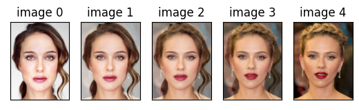

<h1 align="center">A simple tool to morph from one face to another</h1>


<p align="center">
 <h1 align="center">PREVIEW</h1>
 <div style="display: flex; justify-content: center; align-items: center">
  
</div>
</p>

<h2 align="center">Environment</h2>

Clone the repo:
```bash
git clone https://github.com/mejhana/faceMorpher.git
```

Set up enviornment
```bash
conda env create -f environment.yml
conda activate faceMorpher
```

<h2 align="center">Basic Setup</h2>

1. Download 2 images and put them in the images folder
2. Change the code in faceMorpher.py (lines 167 and 168, to the names of these images) 


